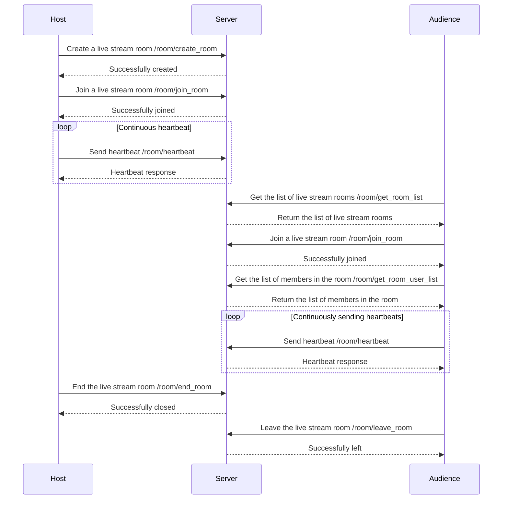

# This article is for teaching purposes only, and ZEGOCLOUD does not provide any maintenance and technical support for it.


# Implement room list service

- - -


During application development, it is often necessary for you to implement a room business service to provide a better experience for app users in most interactive scenarios such as live streaming, voice chat rooms, meetings, online classrooms, etc.

- You need to show an entrance list for app users, allowing them to select the units they are interested in and join the room for interaction.
- After app users join the room, you need to show them the detailed information of the room and provide special features for different roles. For example, the host can start live streaming and the audience can send virtual gifts.


Considering the different business scopes and requirements, we set that you need to maintain your own room/channel data on the server-side and implement features such as data pulling, display, and timely refreshing on the client-side.

This doc will introduce how to implement a room list service.

> This demo only implements the main logic of a simple room list, and you need to expand other business logic by yourself.

## Prerequisites

- You need to have your own business server in order to provide API interfaces for clients.
- (Recommended) You need to have your own database service to persistently store necessary data.


## Preview the effect

This doc will guide you through implementing the following APIs related to the room list service:

- `/room/create_room`: used for the host to create a live stream room.
- `/room/get_room_list`: used for clients to fetch the list of available rooms.
- `/room/get_room_user_list`: used to fetch the list of members in a room.
- `/room/end_room`: used for the host to end the live stream room.
- `/room/join_room`: used for an audience to join a live stream room and update the member list.
- `/room/leave_room`: used for an audience to leave a live stream room and update the member list.
- `/room/heartbeat`: a client heartbeat used for the server to check the user's connection status.


## Understand the tech

<div class="mk-hint">

1. The concept of "room" mentioned in this article refers to the rooms on your business server, rather than those on ZEGOCLOUD. The rooms on ZEGOCLOUD do not need to be created - they are automatically created when a client user joins the room, and are automatically destroyed when all users leave. Therefore, you only need to manage the lifecycle of the rooms on your business server, and do not need to worry about the rooms on ZEGOCLOUD.
2. You can simply associate the rooms on your business server with those on ZEGOCLOUD using the `RoomID`.

</div>


In order to give you a general understanding of the workflow, the following diagram describes the business process of the "host creating a live stream, audience joining the live stream, host ending the live stream, audience leaving the live stream" in a live streaming scenario. Of course, this process also applies to other scenarios, such as a conference list, game room list, etc.




The common room list service requires the following information to be processed:
- Room list and room info: room ID, room name, special role IDs in the room (e.g. host, teacher, etc.), and other room business info (such as room type, etc.).
- Room user list and user information: user ID, user name, entry time, and heartbeat time (for a detailed introduction of user heartbeat, please refer to the following text), as well as other business logic fields and other user info (such as user level, etc.).


<details class="zg-primary">
    <summary>The data structure of the room list service is illustrated by the following examples:</summary>

> You can further optimize and modify it according to specific scenario requirements and the type of database used.

```json
{
  "room_id_1": {
    "room_id": "room_id_1",
    "host_id": "user_id_tom",
    "room_name": "live_room_abc",
    "user_list": [
      {
        "user_id": "user_id_tom",
        "user_name": "tom",
        "join_time": 1631846000000,
        "heartbeat_time": 1631846010000
      },
      {
        "user_id": "user_id_789",
        "user_name": "jerry2",
        "join_time": 1631848000000,
        "heartbeat_time": 1631848010000
      }
    ]
  },
  "room_id_2": {
    "room_id": "room_id_2",
    "host_id": "user_id_jerry",
    "room_name": "live_room_def",
    "user_list": [
      {
        "user_id": "user_id_jerry",
        "user_name": "tom1",
        "join_time": 1631849000000,
        "heartbeat_time": 1631849010000
      },
      {
        "user_id": "user_id_890",
        "user_name": "jerry2",
        "join_time": 1631851000000,
        "heartbeat_time": 1631851010000
      }
    ]
  }
}
```

</details>


## Implementation

For better understanding, this article will provide two types of code snippets:

1. One way is to let the server directly use memory to manage data. This method can help you better understand the server's business logic. However, please note that the data in memory will be lost after the server restarts, so it is not recommended to use this method.
2. Another way is to take Redis as an example and explain how to use a cache database or other databases (such as SQLServer, Firebase-DataBase, etc.) to implement a standard room list service.

> The code snippets in this article uses live streaming scenarios as an example but is also applicable to other scenarios, such as conference lists, game room lists, etc.

### Creating and Ending Rooms

In a room list service, the lifecycle of a room object begins with `creating a room` and ends with `ending a room`.

<details class="zg-primary">
    <summary>1. Use memory or database services to manage data </summary>

- Using Memory (Not recommended)

```js
// Declare variables directly in memory to manage data
const _roomList = {};
```

- Using Redis

```js
// Use a cache database like Redis or other databases (such as SQLServer, Firebase-DataBase, etc.) to manage data
const client = new Redis({
  host: REDIS_HOST,
  port: REDIS_PORT ,
  username: REDIS_USER,
  password: REDIS_PSWD
});

// And bind necessary interfaces such as set, get, delete, etc.
const getAsync = promisify(client.get).bind(client);
const setAsync = promisify(client.set).bind(client);
const delAsync = promisify(client.del).bind(client);
```
  </div>
</div>

</details>

<details class="zg-primary">
    <summary>2. When the client calls the create room API, the server performs necessary error checks and updates the data - creating and saving a room object, recording the room ID, room name, room creator, and other information. </summary>

- Using Memory (Not recommended)

```js
async function _createRoom(RoomID, RoomName, HostID) {
  try {
    if (_roomList[RoomID]) {
      return {
        "code": 1,
        "message": "room already exists",
      };
    } else {
      _roomList[RoomID] = {
        "room_id": RoomID,
        "room_name": RoomName,
        "host_id": HostID,
        "users": {},
      };
      return {
        "code": 0,
        "message": "success",
      };
    }
  } catch (err) {
    console.error(err);
    return {
      "code": 1,
      "message": "create room failed",
    };
  }
}
```

- Using Redis

```js
async function _createRoom(RoomID, RoomName, HostID) {
  try {
    const existingRoom = await getAsync(RoomID);
    if (existingRoom) {
      return {
        "code": 1,
        "message": "room already exists",
      };
    } else {
      const room = {
        "room_id": RoomID,
        "room_name": RoomName,
        "host_id": HostID,
        "users": {},
      };
      await setAsync(RoomID, JSON.stringify(room));
      return {
        "code": 0,
        "message": "success",
      };
    }
  } catch (err) {
    console.error(err);
    return {
      "code": 1,
      "message": "create room failed",
    };
  }
}
```

  </div>
</div>


</details>


<details class="zg-primary">
    <summary>3. When the client calls the end room API, necessary error checks are performed and data is updated - the corresponding room object is found and deleted. </summary>

- Using Memory (Not recommended)


```js
async function _endRoom(RoomID) {
  try {
    if (_roomList[RoomID]) {
      delete _roomList[RoomID];
      return {
        "code": 0,
        "message": "success",
      };
    } else {
      return {
        "code": 1,
        "message": "room not exists",
      };
    }
  } catch (err) {
    console.error(err);
    return {
      "code": 1,
      "message": "end room failed",
    };
  }
}
```

- Using Redis

```js
async function _endRoom(RoomID) {
  try {
    const existingRoom = await getAsync(RoomID);
    if (existingRoom) {
      await delAsync(RoomID);
      return {
        "code": 0,
        "message": "success",
      };
    } else {
      return {
        "code": 1,
        "message": "room not exists",
      };
    }
  } catch (err) {
    console.error(err);
    return {
      "code": 1,
      "message": "end room failed",
    };
  }
}
```

  </div>
</div>


</details>

### Getting the Room List 


When the client requests to get the list of rooms, the server should query the list of rooms from the database and return necessary info to the client so that the client user can select and join a particular room.

Notes: 

1. Usually, you need to selectively return necessary information instead of returning all the server data to the client, as shown in the reference code snippet.
2. If there are many rooms, you need to consider adding the feature of pagination for this interface.
3. You can return a reordered room list to the client based on factors such as room popularity or user preference.

<details class="zg-primary">
    <summary>The reference code snippet for the demo is as follows:</summary>


> In the reference code snippet, to reduce the length of the response body, only necessary info such as room ID, room name, and host name is returned. You can add other necessary info as needed, such as the URL of the room cover image and the room description.

- Using Memory (Not recommended)


```js
async function _getRoomList() {
  try {
    const roomList = Object.values(_roomList).map((room) => {
      return {
        room_id: room.room_id,
        room_name: room.room_name,
        host_id: room.host_id,
      };
    });
    return {
      "code": 0,
      "message": "success",
      "data": roomList,
    };
  } catch (err) {
    console.error(err);
    return {
      "code": 1,
      "message": "get room list failed",
    };
  }
}
```

- Using Redis

```js

async function _getRoomList() {
  try {
    const keys = await promisify(client.keys).bind(client)("*");
    const roomList = await Promise.all(
      keys.map(async (key) => {
        const roomStr = await getAsync(key);
        const room = JSON.parse(roomStr);
        return {
          room_id: room.room_id,
          room_name: room.room_name,
          host_id: room.host_id,
        };
      })
    );
    return {
      "code": 0,
      "message": "success",
      "data": roomList,
    };
  } catch (err) {
    console.error(err);
    return {
      "code": 1,
      "message": "get room list failed",
    };
  }
}
```

  </div>
</div>


</details>


### Joining and Leaving Rooms


The lifecycle of the room user object in the server data usually starts with `joining the room` and ends with `leaving the room` - the logic of `joining and leaving the room` is similar to `Creating and Ending Rooms`, which involves adding and deleting server data.

> If there are special roles in your business, usually the info of these special roles will be bound to the room data. (For example, in the sample demo in this article, the information of the host role is stored in the `host_id` field in the room data structure.)

<details class="zg-primary">
    <summary>1. When a user joins a room, first retrieve the room object from the database, and then add the user info to the member list of the room.</summary>

- Using Memory (Not recommended)


```js
async function _joinRoom(RoomID, UserID, UserName) {
  try {
    if (!_roomList[RoomID]) {
      return {
        "code": 1,
        "message": "room not exists",
      };
    }

    const room = _roomList[RoomID];
    if (room.users && room.users[UserID]) {
      return {
        "code": 1,
        "message": "user already joined",
      };
    }

    if (!room.users) {
      room.users = {};
    }

    const timestamp = new Date().getTime();
    room.users[UserID] = {
      "user_id": UserID,
      "user_name": UserName,
      "join_time": timestamp,
      "heartbeat_time": timestamp,
    };

    return {
      "code": 0,
      "message": "success",
    };
  } catch (err) {
    console.error(err);
    return {
      "code": 1,
      "message": "join room failed",
    };
  }
}
```

- Using Redis

```js
async function _joinRoom(RoomID, UserID, UserName) {
  try {
    const roomString = await getAsync(RoomID);

    if (!roomString) {
      return {
        "code": 1,
        "message": "room not exists",
      };
    }

    const room = JSON.parse(roomString);

    if (room.users && room.users[UserID]) {
      return {
        "code": 1,
        "message": "user already joined",
      };
    }

    if (!room.users) {
      room.users = {};
    }

    const timestamp = new Date().getTime();
    room.users[UserID] = {
      "user_id": UserID,
      "user_name": UserName,
      "join_time": timestamp,
      "heartbeat_time": timestamp,
    };

    await setAsync(RoomID, JSON.stringify(room));

    return {
      "code": 0,
      "message": "join room success",
    };
  } catch (err) {
    console.error(err);
    return {
      "code": 1,
      "message": "join room failed",
    };
  }
}
```

  </div>
</div>


</details>

<details class="zg-primary">
    <summary>2. When a user leaves a room, delete the user from the member list of the room.</summary>

- Using Memory (Not recommended)


```js
async function _leaveRoom(RoomID, UserID) {
  try {
    if (!_roomList[RoomID]) {
      return {
        "code": 1,
        "message": "room not exists",
      };
    }

    const room = _roomList[RoomID];
    if (!room.users || !room.users[UserID]) {
      return {
        "code": 1,
        "message": "user not exists in room",
      };
    }

    delete room.users[UserID];

    return {
      "code": 0,
      "message": "success",
    };
  } catch (err) {
    console.error(err);
    return {
      "code": 1,
      "message": "leave room failed",
    };
  }
}
```

- Using Redis

```js
async function _leaveRoom(RoomID, UserID) {
  try {
    const roomString = await getAsync(RoomID);

    if (!roomString) {
      return {
        "code": 1,
        "message": "room not exists",
      };
    }

    const room = JSON.parse(roomString);

    if (!room.users || !room.users[UserID]) {
      return {
        "code": 1,
        "message": "user not in room",
      };
    }

    delete room.users[UserID];

    await setAsync(RoomID, JSON.stringify(room));

    return {
      "code": 0,
      "message": "leave room success",
    };
  } catch (err) {
    console.error(err);
    return {
      "code": 1,
      "message": "leave room failed",
    };
  }
}
```

  </div>
</div>


</details>

### Getting the Room Member List


Similar to the `Getting the Room List` interface, after a user joins a room, it is usually necessary to request the server to obtain the room member list, and the server should query the user list from the database or cache and return necessary information to the client.


Notes:

1. If there is a lot of data on the server side, you need to selectively return necessary info and consider adding pagination retrieval function to this interface.
2. Based on business needs, you can add other attributes to the members of the room, such as user permissions.

<details class="zg-primary">
    <summary>The reference code snippet for the demo is as follows:</summary>

- Using Memory (Not recommended)


```js
async function _getRoomUserList(RoomID) {
  try {
    if (!_roomList[RoomID]) {
      return {
        "code": 1,
        "message": "room not exists",
      };
    }

    const room = _roomList[RoomID];
    const userList = room.users ? Object.values(room.users) : [];

    return {
      "code": 0,
      "message": "success",
      "data": userList,
    };
  } catch (err) {
    console.error(err);
    return {
      "code": 1,
      "message": "get user list failed",
    };
  }
}
```

- Using Redis

```js
async function _getRoomUserList(RoomID) {
  try {
    const roomString = await getAsync(RoomID);

    if (!roomString) {
      return {
        "code": 1,
        "message": "room not exists",
        userList: [],
      };
    }

    const room = JSON.parse(roomString);
    const userList = Object.values(room.users || {});

    return {
      "code": 0,
      "message": "get user list success",
      userList,
    };
  } catch (err) {
    console.error(err);
    return {
      "code": 1,
      "message": "get user list failed",
      userList: [],
    };
  }
}
```

  </div>
</div>

</details>


### User Heartbeat

User heartbeat is a mechanism that refers to the client regularly sending requests to the server. Through this process, the server can determine whether the client is online and whether the connection between the client and the server is normal. If the server does not receive a heartbeat request from the client within a certain period of time, it can be considered that the client is offline, and then take corresponding measures, such as clearing the client's status info, releasing resources, etc., to improve the stability and reliability of the app.

In our sample demo, the user list in the room will be further maintained based on user heartbeat.

<details class="zg-primary">
    <summary>1. The client needs to regularly send a heartbeat to the server to notify the server of its online status.</summary>

> At the same time, the server will inform the client whether it is still in a normal connection. If the client has disconnected abnormally, the client usually needs to handle the business logic such as relogin.


- Using Memory (Not recommended)


```js
async function _heartbeat(RoomID, UserID) {
  try {
    if (!_roomList[RoomID]) {
      return {
        "code": 1,
        "message": "room not exists",
      };
    }

    const room = _roomList[RoomID];

    if (!room.users || !room.users[UserID]) {
      return {
        "code": 1,
        "message": "user not joined or heartbeat timeout",
      };
    }

    const now = new Date().getTime();
    const userhb = room.users[UserID].heartbeat_time;
    if (now - userhb > HEARTBEAT_TIMEOUT) {
      return {
        "code": 1,
        "message": "heartbeat timeout",
      };
    }

    room.users[UserID].heartbeat_time = now;

    return {
      "code": 0,
      "message": "heartbeat success",
    };
  } catch (err) {
    console.error(err);
    return {
      "code": 1,
      "message": "heartbeat failed",
    };
  }
}
```

- Using Redis

```js
async function _heartbeat(RoomID, UserID) {
  try {
    const roomString = await getAsync(RoomID);

    if (!roomString) {
      return {
        "code": 1,
        "message": "room not exists",
      };
    }

    const room = JSON.parse(roomString);


    if (!room.users || !room.users[UserID]) {
      return {
        "code": 1,
        "message": "user not joined or heartbeat timeout",
      };
    }

    const now = new Date().getTime();
    const userhb = room.users[UserID].heartbeat_time;
    if (now - userhb > HEARTBEAT_TIMEOUT) {
      return {
        "code": 1,
        "message": "heartbeat timeout",
      };
    }

    room.users[UserID].heartbeat_time = now;

    await setAsync(RoomID, JSON.stringify(room));

    return {
      "code": 0,
      "message": "heartbeat success",
    };
  } catch (err) {
    console.error(err);
    return {
      "code": 1,
      "message": `heartbeat failed,error:${err}`,
    };
  }
}
```

  </div>
</div>


</details>


<details class="zg-primary">
    <summary>2. The server will regularly check the heartbeat data in the room, consider users with heartbeat timeout as offline, and remove them from the room list. (This often happens when a user kills the app directly, or the user's client has an abnormal network disconnection, etc.)</summary>


> When the removed client initiates a heartbeat request again, the server will inform the client that a heartbeat timeout has occurred.

- Using Memory (Not recommended)

```js
setInterval(() => {
  _checkHeartbeatTime();
}, HEARTBEAT_TIMEOUT / 3 * 2);


async function _checkHeartbeatTime() {
  try {
    const keys = Object.keys(_roomList);
    await Promise.all(keys.map(async (key) => {
      const room = _roomList[key];
      const users = room.users;
      const expiredUserIDs = Object.keys(users).filter(function (userID) {
        const now = Date.now();
        const userhb = users[userID].heartbeat_time;
        console.log(`now: ${now}, userhb: ${userhb}, diff: ${now - userhb}`);
        return now - userhb > HEARTBEAT_TIMEOUT;
      });
      if (expiredUserIDs.length > 0) {
        expiredUserIDs.forEach((userID) => {
          console.log('mem: User ${userID} has been removed from room ${room.room_id}');
          delete users[userID];
        });
        _roomList[room.room_id] = room;
      } else {
        // console.log('mem: timeout userList is empty');
      }
    }));
    return {
      "code": 0,
      "message": "success",
    };
  } catch (err) {
    console.error(err);
    return {
      "code": 1,
      "message": err,
    };
  }
}
```

- Using Redis

```js
// Start user heartbeat check after connecting to Redis.
client.on('connect', () => {
  console.log('Connected to Redis');
  setInterval(() => {
    _checkHeartbeatTime();
  }, HEARTBEAT_TIMEOUT / 3 * 2);
});

async function _checkHeartbeatTime() {
  try {
    const keys = await promisify(client.keys).bind(client)("*");
    await Promise.all(keys.map(async (key) => {
      const room = JSON.parse(await promisify(client.get).bind(client)(key));
      const users = room.users;
      const expiredUserIDs = Object.keys(users).filter(function (userID) {
        const now = Date.now();
        const userhb = users[userID].heartbeat_time;
        return (now - userhb) > HEARTBEAT_TIMEOUT;
      });
      if (expiredUserIDs.length > 0) {
        expiredUserIDs.forEach((userID) => {
          console.log(`redis: User ${userID} has been removed from room ${room.room_id}`);
          delete users[userID];
        });
        await promisify(client.set).bind(client)(room.room_id, JSON.stringify(room));
      } else {
        // console.log(`redis: timeout userList is empty`);
      }
    }));
    return {
      "code": 0,
      "message": "success",
    };
  } catch (err) {
    console.error(err);
    return {
      "code": 1,
      "message": err,
    };
  }
}
```

  </div>
</div>


</details>


User heartbeat is an indispensable mechanism in app development, which can help you better handle the connection between the client and the server, and provide a better user experience. In some real-time app scenarios, such as online games, interactive videos, etc., user heartbeat can also help the server update other status information of the client. You can expand the status information of user heartbeat according to your own business needs, such as user viewing time, user points, user geographic location, etc. Through these status info the server can better grasp the user's behavior and provide better services and experience.

<details class="zg-primary">
    <summary>Demo's Room List Server Protocol</summary>


- Creating rooms

- Using Memory (Not recommended)

```
http://[your.server.domain]/api/room/redis/create_room?RoomID=room1&RoomName=room1&HostID=host
```

- Using Redis


```
http://[your.server.domain]/api/room/mem/create_room?RoomID=room1&RoomName=room1&HostID=host
```

  </div>
</div>


**Response**:

```json
{
    "code": 0,
    "message": "success"
}
```


- Ending rooms

- Using Memory (Not recommended)

```
http://[your.server.domain]/api/room/redis/end_room?RoomID=room1
```

- Using Redis


```
http://[your.server.domain]/api/room/mem/end_room?RoomID=room1
```

  </div>
</div>


**Response**:

```json
{
    "code": 0,
    "message": "success"
}
```


- Getting room list

- Using Memory (Not recommended)

```
http://[your.server.domain]/api/room/redis/get_room_list
```

- Using Redis


```
http://[your.server.domain]/api/room/mem/get_room_list
```

  </div>
</div>


**Response**:

```json
{
    "code": 0,
    "message": "success",
    "data": [
        {
            "room_id": "room1",
            "room_name": "room1",
            "host_id": "host1"
        }
    ]
}
```


- Joining rooms

- Using Memory (Not recommended)

```
http://[your.server.domain]/api/room/redis/join_room?RoomID=room1&UserID=user2&UserName=user2
```

- Using Redis


```
http://[your.server.domain]/api/room/mem/join_room?RoomID=room1&UserID=user2&UserName=user2
```

  </div>
</div>


**Response**:

```json
{
    "code": 0,
    "message": "success",
}
```


- Leaving rooms

- Using Memory (Not recommended)

```
http://[your.server.domain]/api/room/redis/leave_room?RoomID=room1&UserID=user2
```

- Using Redis


```
http://[your.server.domain]/api/room/mem/leave_room?RoomID=room1&UserID=user2
```

  </div>
</div>


**Response**:

```json
{
    "code": 0,
    "message": "success",
}
```


- Getting user list

- Using Memory (Not recommended)

```
http://[your.server.domain]/api/room/redis/get_room_user_list?RoomID=room1
```

- Using Redis


```
http://[your.server.domain]/api/room/mem/get_room_user_list?RoomID=room1
```

  </div>
</div>


**Response**:

```json
{
	"code": 0,
	"message": "get user list success",
	"userList": [{
		"user_id": "user1",
		"user_name": "user1",
		"join_time": 1679412810925,
		"heartbeat_time": 1679412810925
	}, {
		"user_id": "user2",
		"user_name": "user2",
		"join_time": 1679412810925,
		"heartbeat_time": 1679412810925
	}]
}
```


- User heartbeat 

- Using Memory (Not recommended)

```
http://[your.server.domain]/api/room/redis/heartbeat?RoomID=room1&UserID=user2
```

- Using Redis


```
http://[your.server.domain]/api/room/mem/heartbeat?RoomID=room1&UserID=user2
```

  </div>
</div>


**Response**:

```json
{
    "code": 0,
    "message": "heartbeat success",
}
```

</details>


## Summary

So far, you have completed a basic room list service.

- You can extend more features based on this framework, such as
  - Add more attributes to the room, such as room preview picture, creation time, room mode, etc.
  - Add more attributes to the user, such as user permissions, user roles, user avatars, etc.
  - Make more flexible control over the room lifecycle - such as automatically creating a room in the background, not destroying a specific room, etc.


- Additionally, you can further optimize the architecture, such as
  - Store the basic info of the room list in SQL Server to obtain more reliable persistent storage.
  - Store dynamic info in the room in other more efficient data structures, such as Redis cluster or Firebase Realtime Database, to achieve better real-time update and synchronization performance.
  - You can also add authentication function to the room list service API based on your user login system to identify requests from your real users and improve security.


ZEGOCLOUD provides you with a rich set of server APIs, such as `Room signaling API`, `Streaming control API`, etc., as well as various event callbacks. You can use them to further extend your room services. Please refer to [Server APIs](https://docs.zegocloud.com/article/9780) and [Callback](https://docs.zegocloud.com/article/9804) for more information.

If you have any suggestions or comments, feel free to share them with us via [Discord\|_blank](https://discord.gg/EtNRATttyp). We value your feedback.
